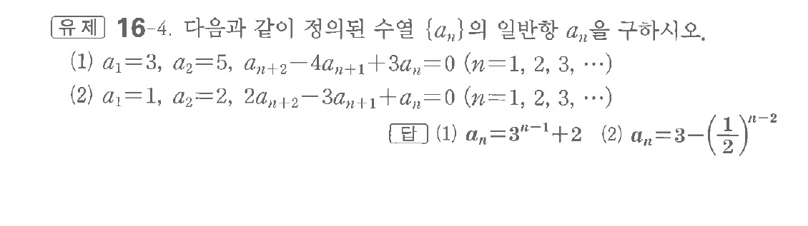
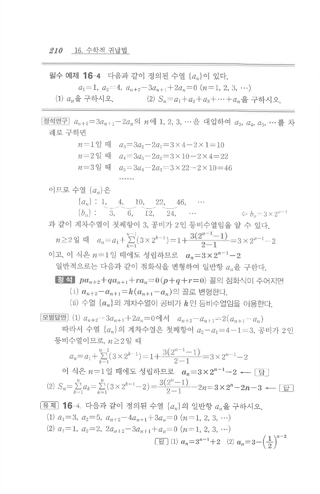

# 유제 16-4

## 문제

다음과 같이 정의된 수열 $\{a_n\}$의 일반항 $a_n$을 구하시오.

(1) $a_1=3,\ a_2=5,\ a_{n+2}-4a_{n+1}+3a_n=0\quad(n=1,2,3,\cdots)$

(2) $a_1=1,\ a_2=2,\ 2a_{n+2}-3a_{n+1}+a_n=0\quad(n=1,2,3,\cdots)$

## 정답

(1) $a_n=3^{n-1}+2$  
(2) $a_n=3-\left(\dfrac12\right)^{n-2}$

## 원문 문제

## 원문

