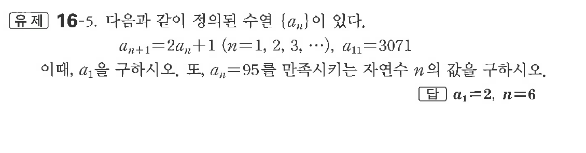
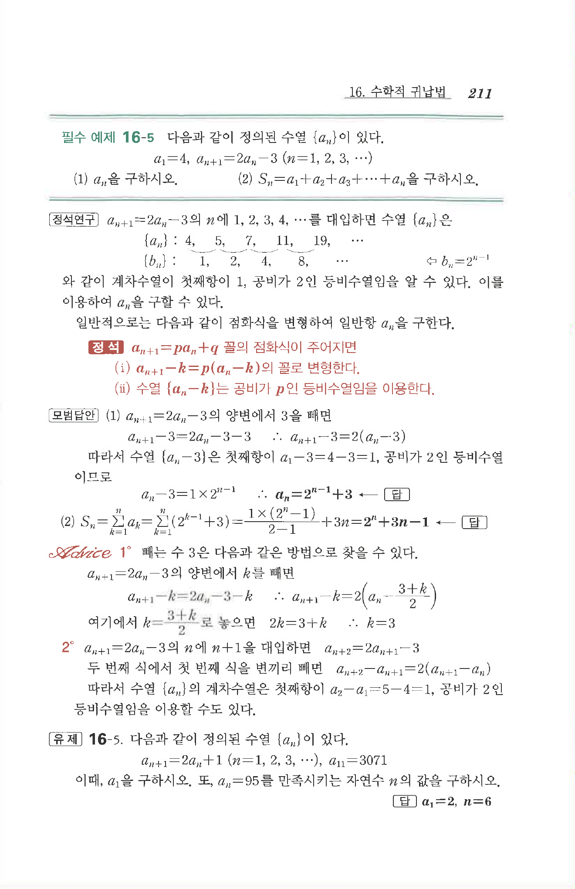

# 유제 16-5

## 문제

다음과 같이 정의된 수열 $\{a_n\}$이 있다.

$$
a_{n+1}=2a_n+1\quad(n=1,2,3,\cdots),\quad a_{11}=3071
$$

이때, $a_1$을 구하시오. 또, $a_n=95$를 만족시키는 자연수 $n$의 값을 구하시오.

## 정답

$a_1=2,\quad n=6$

## 원문 문제

## 원문

