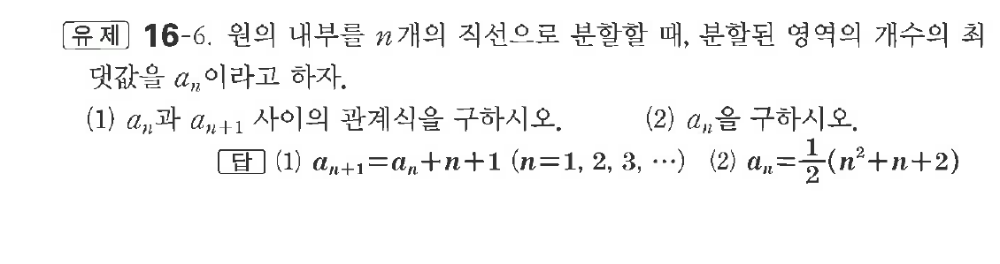
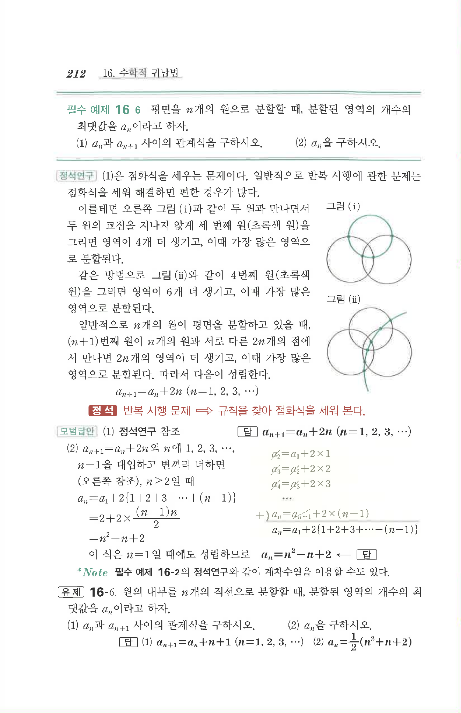

# 유제 16-6

## 문제

원의 내부를 $n$개의 직선으로 분할할 때, 분할된 영역의 개수의 최댓값을 $a_n$이라고 하자.

(1) $a_n$과 $a_{n+1}$ 사이의 관계식을 구하시오.

(2) $a_n$을 구하시오.

## 정답

(1) $a_{n+1}=a_n+n+1\quad(n=1,2,3,\cdots)$  
(2) $a_n=\dfrac12(n^2+n+2)$

## 원문 문제

## 원문

