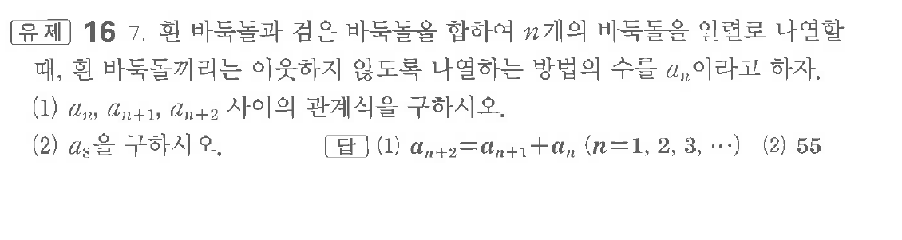

# 유제 16-7

## 문제

흰 바둑돌과 검은 바둑돌을 합하여 $n$개의 바둑돌을 일렬로 나열할 때, 흰 바둑돌끼리는 이웃하지 않도록 나열하는 방법의 수를 $a_n$이라고 하자.

(1) $a_n,\ a_{n+1},\ a_{n+2}$ 사이의 관계식을 구하시오.

(2) $a_8$을 구하시오.

## 정답

(1) $a_{n+2}=a_{n+1}+a_n\quad(n=1,2,3,\cdots)$  
(2) $55$

## 원문 문제

## 원문

