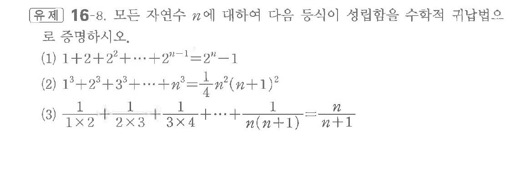

# 유제 16-8

## 문제

모든 자연수 $n$에 대하여 다음 등식이 성립함을 수학적 귀납법으로 증명하시오.

(1) $1+2+2^2+\cdots+2^{n-1}=2^n-1$

(2) $1^3+2^3+3^3+\cdots+n^3=\dfrac14n^2(n+1)^2$

(3) $\dfrac1{1\times2}+\dfrac1{2\times3}+\dfrac1{3\times4}+\cdots+\dfrac1{n(n+1)}=\dfrac n{n+1}$

## 원문 문제

## 원문

