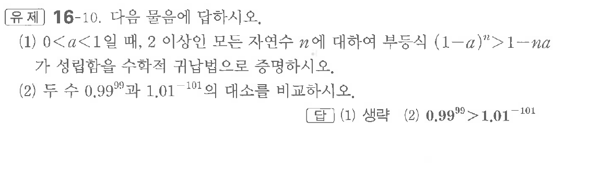

# 유제 16-10

## 문제

다음 물음에 답하시오.

(1) $0<a<1$일 때, $2$ 이상인 모든 자연수 $n$에 대하여 부등식 $(1-a)^n>1-na$가 성립함을 수학적 귀납법으로 증명하시오.

(2) 두 수 $0.99^{99}$과 $1.01^{-101}$의 대소를 비교하시오.

## 정답

(1) 생략  
(2) $0.99^{99}>1.01^{-101}$

## 원문 문제

## 원문

